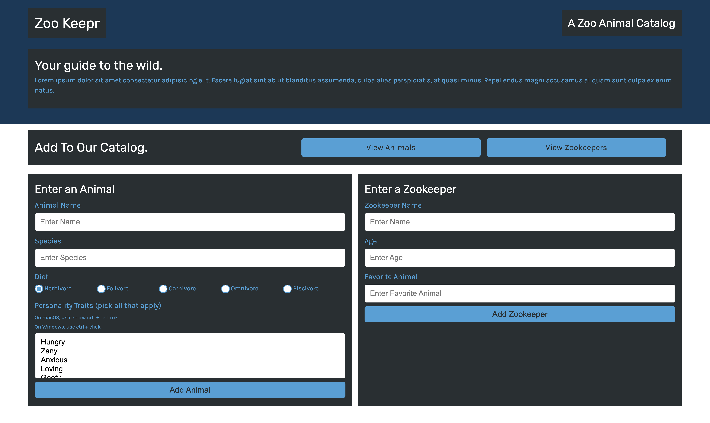

## Zoo Keeper

## Description 
An application for a Zoo that keeps track of the database of animals so the user can search a directory before their visit.

## Tables of Contents
* [Installation](#installation)
* [Deployed App](#deployed-app)
* [Usage](#usage)
* [Questions](#questions)

## Installation 
* clone the repo
* `npm init --y`
* `npm install `
* `npm start`

## Contributing
N/A

## Questions
For any questions please reach out to 
github: [celinalou92](https://github.com/celinalou92)
email: celinalouissaint@gmail.com

